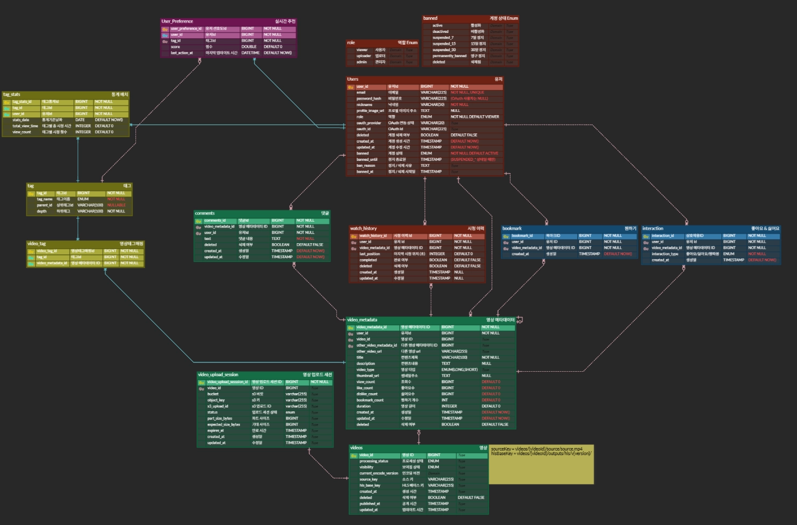
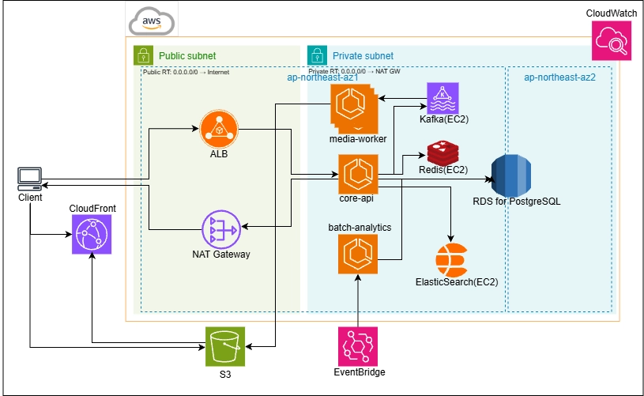
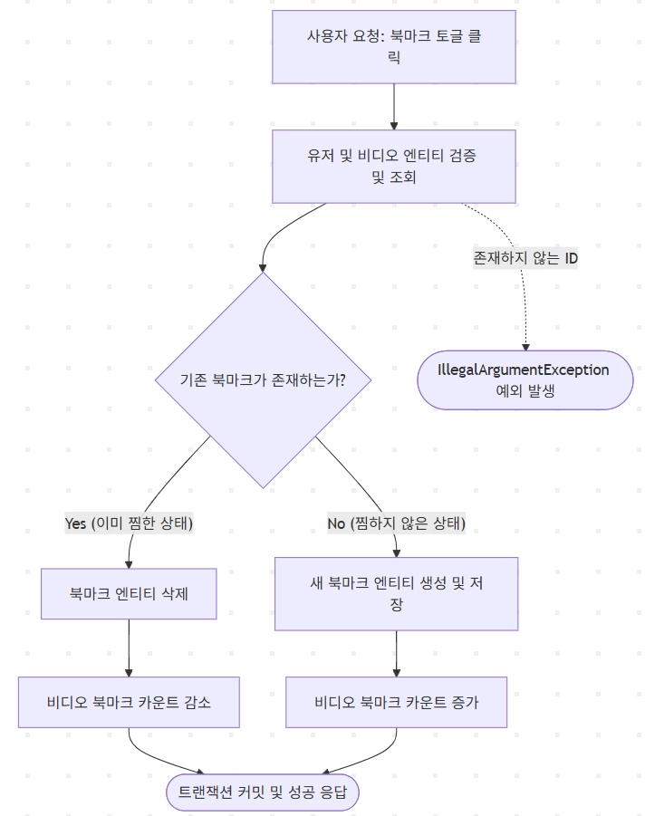
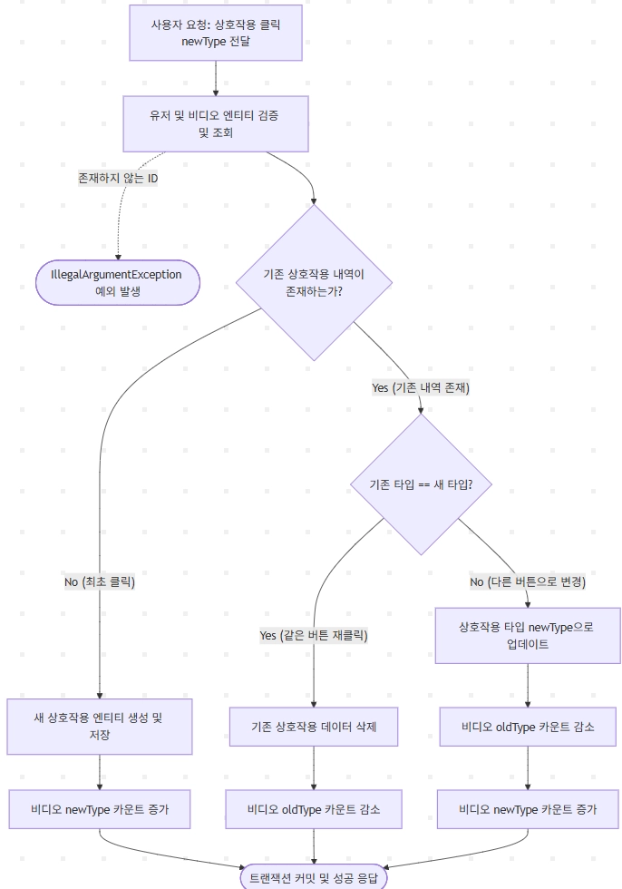
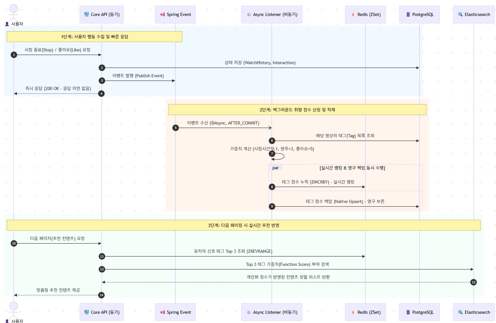
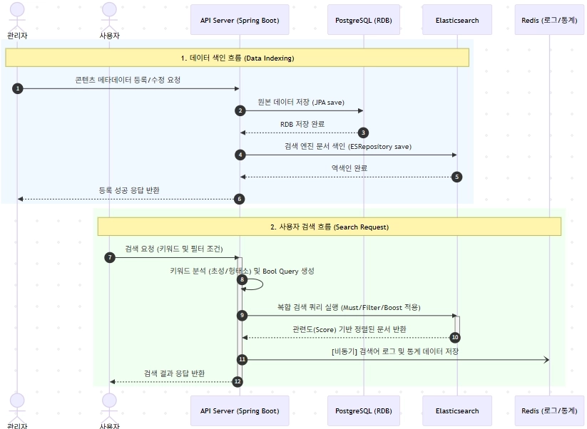
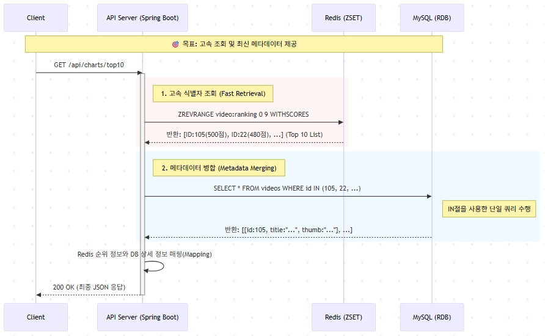
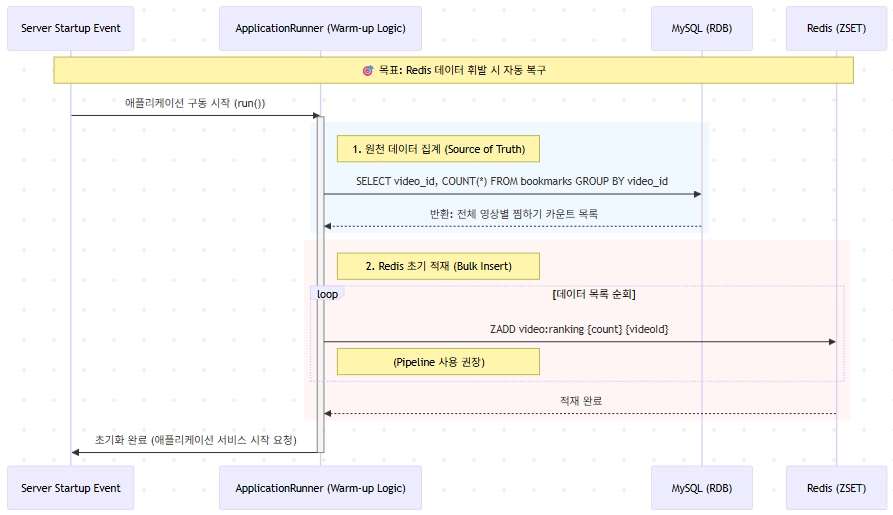
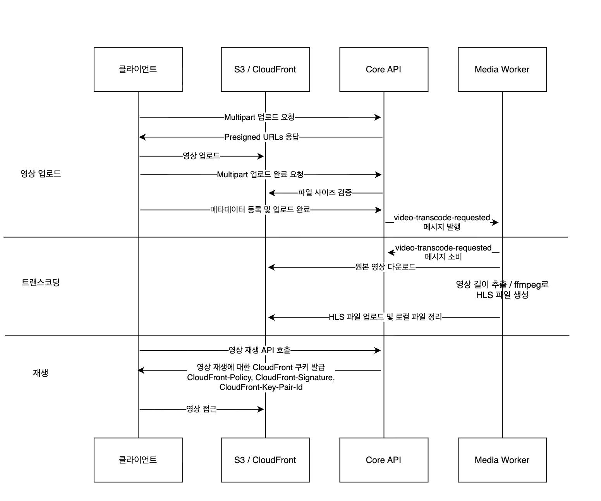

# Adults-Nara_BE

## 🧭 목차
- [🏢 아키텍처 설계](#-아키텍처-설계)
    - [최종 구조](#최종-구조)
    - [ERD](#erd)
    - [Infrastructure Architecture](#infrastructure-architecture)
- [🎯 트래픽 플로우 요약](#-트래픽-플로우-요약)
    - [1) 사용자 API 흐름](#1-사용자-api-흐름-client--alb--core-api)
    - [2) 영상 재생 흐름](#2-영상-재생-흐름-client--cloudfront--s3)
    - [3) 업로드/트랜스코딩 흐름](#3-업로드트랜스코딩-흐름-core-api--kafka--media-worker--s3)
    - [4) 검색 흐름](#4-검색-흐름-core-api--elasticsearch-redis)
    - [5) 배치 분석 흐름](#5-배치-분석-흐름-eventbridge--batch-analytics--rds)
- [🔐 네트워크/보안 원칙](#-네트워크보안-원칙)
- [📈 운영 모니터링](#-운영-모니터링-cloudwatch)
- [🧩 도메인별 설계 및 구현 전략](#-도메인별-설계-및-구현-전략)
    - [1. 상호작용 & 북마크 & 통계](#1-상호작용--북마크--통계)
    - [2. 추천: 태그 기반 실시간 맞춤형 추천 시스템](#2-추천-태그-기반-실시간-맞춤형-추천-시스템)
    - [3. 검색: 한글 특화 검색](#3-검색-한글-특화-검색)
    - [4. 실시간 인기차트: Bookmark 기반 Top 10](#4-실시간-인기차트-bookmark-기반-top-10)
    - [5. 영상: 업로드 / 트랜스코딩 / 재생(권한)](#5-영상-업로드--트랜스코딩--재생권한)

---

## 🏢 아키텍처 설계

기존 **모놀리식 아키텍처**는 로그인/검색처럼 **짧고 빈번한 API 트래픽**과, 업로드/트랜스코딩처럼 **무겁고 장시간 수행되는 워크로드**가 하나의 배포 단위에 함께 묶입니다. 그 결과 다음 문제가 발생합니다.

- **확장성 한계**: 업로드/트랜스코딩만 병목이 생겨도 전체 애플리케이션을 함께 스케일아웃해야 하므로 비용 효율이 떨어집니다.
- **장애 전파**: 미디어 처리 부하(CPU/IO)나 장애가 같은 런타임에서 동작하는 API 품질까지 떨어뜨릴 수 있습니다.
- **유지보수 부담 증가**: 도메인이 늘어날수록(`user/video/watch/bookmark/comment/interaction/search/tag` + 추천/통계) 경계가 흐려지고 테스트/배포 비용이 급격히 증가합니다.

이를 해결하기 위해, “변경 이유가 비슷한 것끼리” 묶어 **도메인 경계를 명확히** 하고 모듈 간 노출을 최소화하는 **모듈러 모놀리식**을 채택했습니다. 또한 워크로드 성격에 따라 배포 단위를 **3개로 제한**하여 운영 복잡도를 억제하면서도 확장성을 확보했습니다.

특히 업로드/트랜스코딩은 요청-응답 구조로 처리하지 않고, `core-api → Kafka → media-worker`의 **비동기 이벤트 기반 처리**로 분리했습니다. 이를 통해 API 응답 지연과 장애 전파를 최소화하고, media-worker는 트래픽 증가 시 **수평 확장(Scale-out)** 이 용이하도록 설계했습니다.

### 최종 구조

#### `apps/core-api` (🌐 Main API)
- **사용자-facing 메인 API 서버**
- **도메인 모듈**: `user, video, watch, bookmark, comment, interaction, search, tag`
- **책임**
    - 인증/인가, 정책, 메타데이터 관리
    - 시청 이력 적재/조회
    - 업로드 요청 접수 및 미디어 처리 이벤트 발행(`core-api → Kafka → media-worker`)

#### `apps/media-worker` (⚙️ Media Pipeline)
- **미디어 처리 백그라운드 워커**
- **책임**
    - FFmpeg 트랜스코딩 및 산출물 업로드
    - 처리 상태 업데이트
- **특징**
    - API 서버와 분리하여 사용자 요청 안정성 확보
    - 워커 수 증설을 통한 **Scale-out** 용이

#### `apps/batch-analytics` (📊 Batch/Analytics)
- **집계/통계 배치 작업**
- **책임**
    - 시청/로그 기반 주기적 통계 집계
    - 실시간 트랜잭션과 분리하여 리소스 충돌 최소화

#### `common`
- **공통(범용) 코드 모듈**
- 예: `persistence base/entity/enums`, `util/response/error`
- 원칙: 특정 도메인 규칙이 내려오지 않도록 공통화 기준을 엄격히 유지

### ERD

### Infrastructure Architecture

---

## 🎯 트래픽 플로우 요약

### 1) 사용자 API 흐름 (Client → ALB → core-api)
- 사용자는 로그인/목록/상세/댓글 등 API를 호출합니다.
- 요청은 **ALB**로 유입되어 **Private Subnet의 core-api**로 전달됩니다.
- core-api는 기능에 따라 **RDS(PostgreSQL)**(영속 데이터), **Redis**(캐시), **Elasticsearch**(검색)를 사용해 응답합니다.

### 2) 영상 재생 흐름 (Client → CloudFront → S3)
- 재생 트래픽은 API 서버가 아닌 **CloudFront(CDN)** 가 처리하여 성능/비용을 최적화합니다.
- 플레이어가 CloudFront로 **m3u8/segment**를 요청하고,
    - **Cache Hit**: 즉시 응답
    - **Cache Miss**: S3에서 가져와 전달
- 동시 접속/반복 시청이 증가할수록 캐시 효율이 올라가 S3 원본 트래픽이 줄어듭니다.

### 3) 업로드/트랜스코딩 흐름 (core-api → Kafka → media-worker → S3)
- 업로드는 **S3 Presigned URL**로 클라이언트가 S3에 직접 업로드합니다(서버 부하 최소화).
- 업로드 완료 후 core-api가 **Kafka**로 “트랜스코딩 요청 이벤트”를 발행합니다.
- **media-worker**가 이벤트를 consume하여 FFmpeg 트랜스코딩 후 결과물을 **S3**에 업로드하고, 필요 시 상태를 **RDS**에 반영합니다.
- 트랜스코딩 완료 콘텐츠는 재생 시 **CloudFront → S3** 경로로 제공됩니다.

### 4) 검색 흐름 (core-api ↔ Elasticsearch, Redis)
- 검색 요청은 core-api가 받고, 본 검색은 **Elasticsearch**로 수행합니다.
- 인기 검색어/추천어 등은 **Redis 캐시**로 응답 지연을 줄일 수 있습니다.

### 5) 배치 분석 흐름 (EventBridge → batch-analytics → RDS)
- **EventBridge 스케줄(예: 매일 03:00)** 로 batch-analytics를 실행합니다.
- watch/interaction 기반 통계를 집계해 결과를 **RDS**에 적재합니다.

## 🔐 네트워크/보안 원칙
- **Public Subnet**: ALB, NAT Gateway만 배치
- **Private Subnet**: core-api / worker / DB / Kafka / Redis / ES 배치(직접 접근 차단)
- 외부 인바운드는 **ALB 단일 진입점**으로 단순화, 아웃바운드는 필요 시 **NAT Gateway** 사용

## 📈 운영 모니터링 (CloudWatch)
- core-api / media-worker / batch-analytics 로그 및 지표를 수집하여:
    - 업로드 이벤트 처리 지연
    - 트랜스코딩 실패율
    - 검색 응답 지연
    - DB CPU/Connection 이상
    - Kafka Consumer Lag
      를 모니터링합니다.

---

## 🧩 도메인별 설계 및 구현 전략

### 1. 상호작용 & 북마크 & 통계

#### ① 요구사항(문제/목표)
- 사용자는 영상에 **좋아요/싫어요/슈퍼라이크** 반응을 남기고 **언제든 변경** 가능해야 함
- 사용자는 영상을 **북마크(찜)** 하거나 해제하는 **On/Off** 기능이 필요
- 피드/상세에서 **좋아요 수, 북마크 수** 등의 **누적 합계**를 실시간에 가깝게 보여줘야 함
- 읽기 트래픽이 많을 때 `COUNT()` 기반 집계는 성능 병목이 될 수 있음

#### ② 도메인 책임 & 설계 전략
- **Interaction 도메인**
    - 책임: 사용자 ↔ 영상 간 “반응 상태”를 표현
    - 전략: `Interaction` 단일 엔티티 + `InteractionType(Enum)`로 상태 관리 (Like/Dislike/SuperLike)
- **Bookmark 도메인**
    - 책임: 사용자 ↔ 영상 간 “찜 상태”를 표현
    - 전략: 레코드 **존재 여부 기반 토글**(있으면 해제, 없으면 생성)
- **VideoMetadata 도메인**
    - 책임: 영상 단위의 집계/통계(좋아요 수, 찜 수 등)를 빠르게 제공
    - 전략: 카운트 컬럼을 **역정규화(denormalization)** 하여 저장 (매번 COUNT 회피)

#### ③ 결정
- ✅ `Interaction(상태 Enum)` / ✅ `Bookmark(존재 토글)` / ✅ `VideoMetadata(카운트 역정규화)`

#### ④ 선정 근거 & 운영 포인트
- **Interaction 단일 엔티티 + Enum**
    - 상태 전환(좋아요→싫어요 등)이 명확하고 변경 로직이 단순
    - 반응 종류가 늘어나도 Enum 확장으로 대응 가능
- **Bookmark 토글**
    - 쿼리/상태 모델이 단순해 결합도 낮고 처리 속도 빠름
- **VideoMetadata 역정규화**
    - 읽기 요청이 많은 서비스에서 COUNT 기반 집계 비용을 제거
    - “조회는 빠르게, 갱신은 신중하게(동시성)” 구조로 성능을 확보

#### ⑤ 구현 스텝
1. Interaction/Bookmark 요청 처리 → 해당 테이블에 반영
2. 반영 결과에 따라 VideoMetadata 카운트(+1/-1) 갱신
3. 조회 API는 VideoMetadata 카운트를 그대로 반환(집계 쿼리 최소화)

---

### 2. 추천: 태그 기반 실시간 맞춤형 추천 시스템

#### ① 요구사항(문제/목표)
- 사용자 행동(좋아요/시청/완주)이 **다음 피드에 1초 이내 반영**
- 잦은 쓰기(예: 10초 주기 시청 위치 업데이트)가 **메인 서버 응답에 영향이 없어야 함**
- 행동 깊이에 따른 가중치:
    - 시청 1분당 +0.1점 / 완주 +3.0점 / 좋아요 +5.0점

#### ② 도메인 책임 & 설계 전략
- **Interaction & WatchHistory**
    - 책임: “행동 사실”을 저장하고 이벤트를 발행
    - 전략: DB 기록 후 `ApplicationEvent` 발행, **즉시 응답 반환**
- **UserPreference(취향 분석)**
    - 책임: 이벤트 기반으로 태그 점수 산정 및 적재
    - 전략: `@Async` Listener에서 백그라운드 처리, Redis/RDB 적재는 별도 수행

#### ③ 결정
- ✅ **이벤트 기반 비동기 분석 + Redis ZSet 실시간 집계 + RDB 영속 백업 + ES 개인화 서빙**

#### ④ 선정 근거 & 운영 포인트
- **메인 경로 응답 보호:** write-heavy 이벤트를 비동기 처리로 분리
- **실시간성:** Redis ZSet `ZINCRBY`로 즉시 취향 반영
- **복구/정합성:** RDB에 Upsert로 영속 저장(Redis 휘발 대비)
- **서빙 유연성:** ES `function_score`로 텍스트/인기도/취향 점수 결합

#### ⑤ 구현 스텝
1. **Publishing**: 시청 종료/좋아요 시 `InteractionEvent` 발행 → 즉시 응답
2. **Async Listener**: 태그별 점수 계산(가중치 적용)
3. **Fast Write**: Redis `ZINCRBY`로 태그 점수 누적
4. **Persistent Backup**: PostgreSQL `ON CONFLICT DO UPDATE`로 영속화
5. **Serving**: 피드 요청 시 Redis Top 태그 조회 → ES `Function Score`에 Boost로 주입

---

### 3. 검색: 한글 특화 검색

#### ① 요구사항(문제/목표)
- 비디오 메타데이터 기반 검색을 **100ms 이내**로 응답
- 한글 검색 품질: 형태소/복합명사, 초성, 오타 보정, 자동완성
- 필터(장르/등급 등)는 빠르게 처리되어야 함

#### ② 도메인 책임 & 설계 전략
- **전처리/입력 단계**
    - 자동완성: `Edge N-gram Tokenizer`
    - 초성 검색: 초성 변환 필드 별도 저장
    - 오타 보정: `Fuzzy Query`
- **검색 수행 단계**
    - `Nori Analyzer`로 조사/어미 제거, 핵심 토큰 기반 검색
    - Decompound로 복합명사 분해 + 원형 기반 매칭
- **검색 후 단계**
    - 필터는 `Filter Query`로 스코어 계산 제외(캐시/성능)
    - 제목에 가중치(Boost) 부여로 품질 개선

#### ③ 결정
- ✅ **ES 인덱스 다중 필드(Nori + Ngram) + Bool Query 최적화 + Filter 분리 + 초성/Fuzzy 지원**

#### ④ 선정 근거 & 운영 포인트
- **응답속도:** 필터 컨텍스트 분리로 스코어 계산 비용 최소화
- **검색품질:** Nori + 복합명사 처리로 한글 의미 단위 검색 강화
- **사용성:** 자동완성/초성/오타 보정으로 입력 허들 감소

#### ⑤ 구현 스텝
1. **Index/Mapping**: Nori + Edge N-gram 조합, 제목 다중필드, 장르/등급 keyword
2. **Sync(Double Write)**: JPA save 후 ES save 순차 호출
3. **Query 최적화**: Must(본문/제목) + Filter(장르/등급) + 제목 Boost
4. **피드백 강화**: 초성 필드 저장 + Fuzzy 적용

---

### 4. 실시간 인기차트: Bookmark 기반 Top 10

#### ① 요구사항(문제/목표)
- 찜하기 데이터를 기반으로 **실시간 인기 Top 10** 제공
- RDB 단독 사용 시 정렬 부하/동시성 문제 발생 가능
- Redis 휘발 대비 **복구/정합성** 필요

#### ② 도메인 책임 & 설계 전략
- **집계(Write Path): Dual Write + 비동기**
    - Bookmark는 RDB에 영속 저장
    - 동시에 Redis ZSet에 점수 갱신(`ZINCRBY`)
- **조회(Read Path): Look-aside + Metadata Merging**
    - Redis에서 Top 10 videoId 조회
    - RDB에서 `IN` 쿼리로 메타데이터 일괄 조회 후 병합
- **복구: Server Warm-up**
    - 서버 시작 시 RDB 집계를 Redis로 복구(`ApplicationRunner`)

#### ③ 결정
- ✅ **Redis ZSet 랭킹 + RDB 메타데이터 병합 + Warm-up 복구**

#### ④ 선정 근거 & 운영 포인트
- **실시간 랭킹:** Redis 정렬 자료구조로 정렬 부하 제거
- **조회 성능:** Top N id 조회(빠름) + 메타데이터 일괄 조회로 효율적
- **가용성:** Redis 재시작/유실 대비 Warm-up으로 정합성 회복

#### ⑤ 구현 스텝
1. **Write**: Bookmark INSERT + `ZINCRBY video:ranking 1 {videoId}`
2. **Read**: `ZREVRANGE`로 Top 10 → RDB `IN` 조회 → 병합 반환
3. **Warm-up**: `ApplicationRunner`로 RDB 집계 → Redis 재적재

---

### 5. 영상: 업로드 / 트랜스코딩 / 재생(권한)

#### ① 요구사항(문제/목표)
- 대용량 업로드를 안정적으로 처리(분할 업로드)
- 트랜스코딩은 비동기/내구성 있게 처리(실패 비용 큼)
- 재생은 인증 사용자만 가능해야 하며, S3 직접 접근을 막아야 함

#### ② 도메인 책임 & 설계 전략
- **업로드**
    - 전략: Presigned URL 기반 Multipart 업로드
    - 업로드 완료 시 서버가 S3 검증 후 “트랜스코딩 요청 이벤트” 발행
- **트랜스코딩**
    - 전략: Kafka 토픽(`video-transcode-requested`) 기반 워커 처리
    - ffmpeg로 HLS 생성 → S3 업로드 → 로컬 정리
- **재생/권한**
    - 전략: CloudFront Signed Cookie 발급으로 CDN 경로 접근 제어
    - S3는 private, CloudFront를 통해서만 접근

#### ③ 결정
- ✅ **Presigned Multipart 업로드 + Kafka 기반 트랜스코딩 워커 + CloudFront Signed Cookie 재생 권한**

#### ④ 선정 근거 & 운영 포인트
- **업로드 안정성:** 클라이언트가 S3로 직접 업로드해 서버 부하 감소
- **비동기 처리:** 트랜스코딩을 메시지 기반으로 분리해 확장/복구 용이
- **보안/서빙:** Signed Cookie로 “인가된 사용자만 재생” 보장

#### ⑤ 구현 스텝

**[업로드]**
1. 클라이언트 → Core API: Multipart 업로드 요청
2. Core API → 클라이언트: Presigned URL 목록 발급
3. 클라이언트 → S3: Presigned URL로 파트 업로드
4. 클라이언트 → Core API: 업로드 완료 API 호출
5. Core API → S3 검증(사이즈 등) → Kafka 토픽 발행
6. 클라이언트 → Core API: 메타데이터 등록으로 마무리

**[트랜스코딩]**
1. MediaWorker ← Kafka(`video-transcode-requested`) 수신
2. S3에서 원본 다운로드
3. 길이 추출/메타 저장 + ffmpeg로 HLS 생성
4. HLS를 S3 업로드 후 로컬 파일 삭제

**[재생]**
1. 클라이언트 → Core API: 재생 API 호출
2. Core API: `SignedCookieProcessor`가 CloudFront 쿠키 발급
3. 클라이언트: 쿠키로 CloudFront 경로 접근하여 재생
