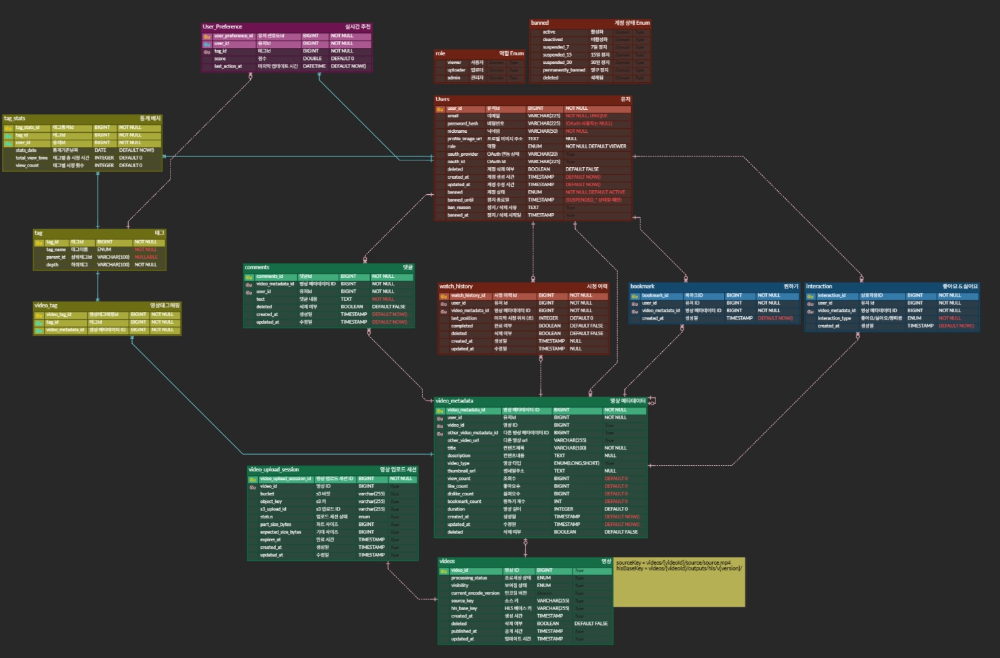
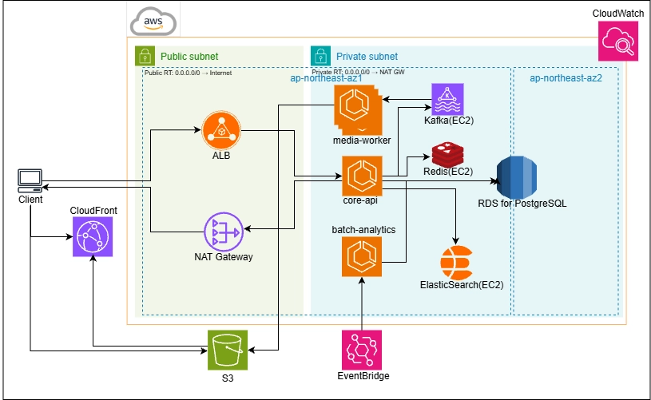
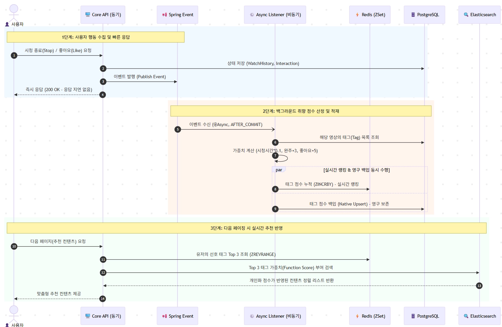
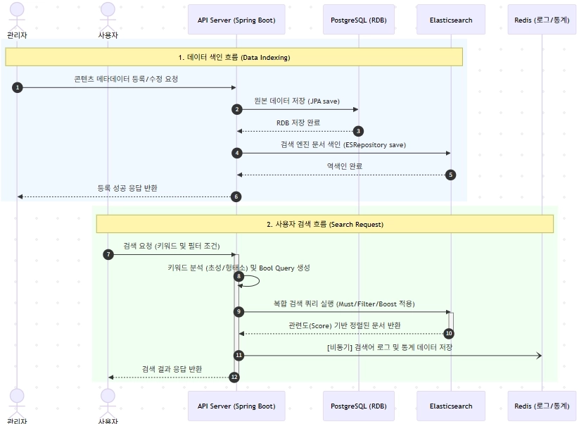
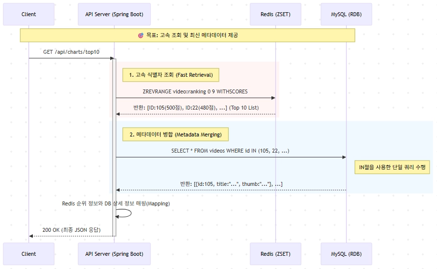
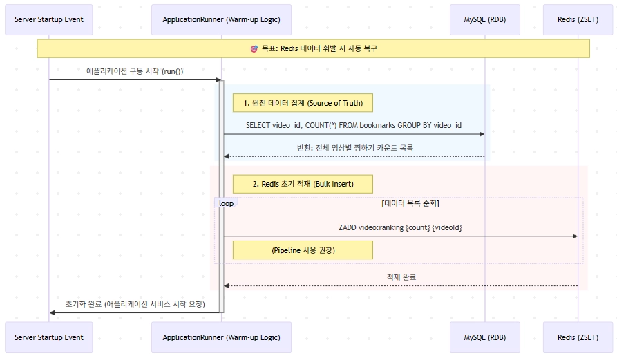
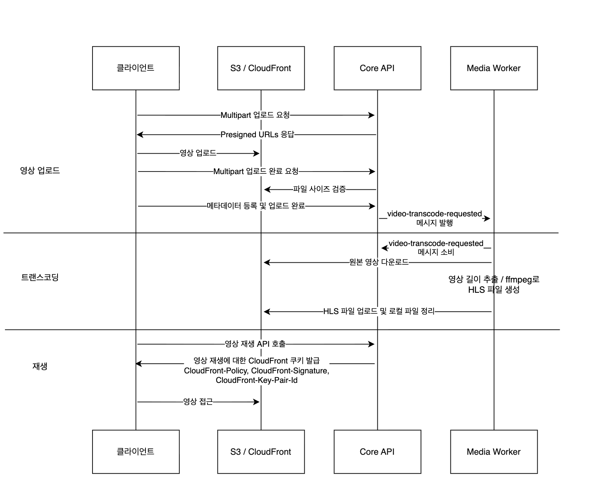

# Adults-Nara_BE
## 🧭 목차
- [🏢 아키텍처 설계](#-아키텍처-설계)
    - [최종 구조](#최종-구조)
    - [ERD](#erd)
    - [Infrastructure Architecture](#infrastructure-architecture)
- [🎯 트래픽 플로우 요약](#-트래픽-플로우-요약)
    - [1) 사용자 API 흐름](#1-사용자-api-흐름-client--alb--core-api)
    - [2) 영상 재생 흐름](#2-영상-재생-흐름-client--cloudfront--s3)
    - [3) 업로드/트랜스코딩 흐름](#3-업로드트랜스코딩-흐름-core-api--kafka--media-worker--s3)
    - [4) 검색 흐름](#4-검색-흐름-core-api--elasticsearch-redis)
    - [5) 배치 분석 흐름](#5-배치-분석-흐름-eventbridge--batch-analytics--rds)
- [🔐 네트워크/보안 원칙](#-네트워크보안-원칙)
- [📈 운영 모니터링](#-운영-모니터링-cloudwatch)
- [🧩 도메인별 설계 및 구현 전략](#-도메인별-설계-및-구현-전략)
    - [1. 상호작용 & 북마크 & 통계](#1-상호작용--북마크--통계)
    - [2. 추천: 태그 기반 실시간 맞춤형 추천 시스템](#2-추천-태그-기반-실시간-맞춤형-추천-시스템)
    - [3. 추천: Elasticsearch 기반 하이브리드 추천 피드](#3-추천-Elasticsearch-기반-하이브리드-추천-피드)
    - [4. 검색: 한글 특화 검색](#4-검색-한글-특화-검색)
    - [5. 실시간 인기차트: Bookmark 기반 Top 10](#5-실시간-인기차트-bookmark-기반-top-10)
    - [6. 영상: 업로드 / 트랜스코딩 / 재생(권한)](#6-영상-업로드--트랜스코딩--재생권한)
    - [7. 인증: Kakao OAuth2 소셜 로그인](#7-인증-kakao-oauth2-소셜-로그인)
    - [8. 인증: 백오피스 JWT](#8-인증-백오피스-jwt-httponly-cookie--rtr)
    - [9. 배치: Spring Batch 월간 시청 통계](#9-배치-spring-batch-월간-시청-통계)
- [🛠️ 기술 스택 근거](#-기술-스택-근거)
    - [1. Message Broker: Apache Kafka vs RabbitMQ](#1-message-broker-apache-kafka-vs-rabbitmq)
    - [2. 검색 엔진 선정: Elasticsearch vs OpenSearch](#2--검색-엔진-선정-elasticsearch-vs-opensearch)
    - [3. 데이터 동기화 파이프라인: Spring Boot(Application Layer) vs Logstash](#3--데이터-동기화-파이프라인-spring-bootapplication-layer-vs-logstash)
    - [4. 사용자 취향 점수 실시간 집계: Redis ZSet vs RDBMS vs Batch](#4--사용자-취향-점수-실시간-집계-redis-zset-vs-rdbms-vs-batch)
    - [5. 추천 서빙: ES + Redis ZSet vs Python ML vs Redis SINTER](#6--추천-서빙-es--redis-zset-vs-python-ml-vs-redis-sinter)
    - [6. 영상 시청: CloudFront + S3](#7--영상-시청-cloudfront--s3)
---

## 🏢 아키텍처 설계

기존 **모놀리식 아키텍처**는 로그인/검색처럼 **짧고 빈번한 API 트래픽**과, 업로드/트랜스코딩처럼 **무겁고 장시간 수행되는 워크로드**가 하나의 배포 단위에 함께 묶입니다. 그 결과 다음 문제가 발생합니다.

- **확장성 한계**: 업로드/트랜스코딩만 병목이 생겨도 전체 애플리케이션을 함께 스케일아웃해야 하므로 비용 효율이 떨어집니다.
- **장애 전파**: 미디어 처리 부하(CPU/IO)나 장애가 같은 런타임에서 동작하는 API 품질까지 떨어뜨릴 수 있습니다.
- **유지보수 부담 증가**: 도메인이 늘어날수록(`user/video/watch/bookmark/comment/interaction/search/tag` + 추천/통계) 경계가 흐려지고 테스트/배포 비용이 급격히 증가합니다.

이를 해결하기 위해, “변경 이유가 비슷한 것끼리” 묶어 **도메인 경계를 명확히** 하고 모듈 간 노출을 최소화하는 **모듈러 모놀리식**을 채택했습니다. 또한 워크로드 성격에 따라 배포 단위를 **3개로 제한**하여 운영 복잡도를 억제하면서도 확장성을 확보했습니다.

특히 업로드/트랜스코딩은 요청-응답 구조로 처리하지 않고, `core-api → Kafka → media-worker`의 **비동기 이벤트 기반 처리**로 분리했습니다. 이를 통해 API 응답 지연과 장애 전파를 최소화하고, media-worker는 트래픽 증가 시 **수평 확장(Scale-out)** 이 용이하도록 설계했습니다.

### 최종 구조

#### `apps/core-api` (🌐 Main API)
- **사용자-facing 메인 API 서버**
- **도메인 모듈**: `user, video, watch, bookmark, comment, interaction, search, tag`
- **책임**
    - 인증/인가, 정책, 메타데이터 관리
    - 시청 이력 적재/조회
    - 업로드 요청 접수 및 미디어 처리 이벤트 발행(`core-api → Kafka → media-worker`)

#### `apps/media-worker` (⚙️ Media Pipeline)
- **미디어 처리 백그라운드 워커**
- **책임**
    - FFmpeg 트랜스코딩 및 산출물 업로드
    - 처리 상태 업데이트
- **특징**
    - API 서버와 분리하여 사용자 요청 안정성 확보
    - 워커 수 증설을 통한 **Scale-out** 용이

#### `apps/batch-analytics` (📊 Batch/Analytics)
- **집계/통계 배치 작업**
- **책임**
    - 시청/로그 기반 주기적 통계 집계
    - 실시간 트랜잭션과 분리하여 리소스 충돌 최소화

#### `common`
- **공통(범용) 코드 모듈**
- 예: `persistence base/entity/enums`, `util/response/error`
- 원칙: 특정 도메인 규칙이 내려오지 않도록 공통화 기준을 엄격히 유지

### ERD


### Infrastructure Architecture


---

## 🎯 트래픽 플로우 요약

### 1) 사용자 API 흐름 (Client → ALB → core-api)
- 사용자는 로그인/목록/상세/댓글 등 API를 호출합니다.
- 요청은 **ALB**로 유입되어 **Private Subnet의 core-api**로 전달됩니다.
- core-api는 기능에 따라 **RDS(PostgreSQL)**(영속 데이터), **Redis**(캐시), **Elasticsearch**(검색)를 사용해 응답합니다.

### 2) 영상 재생 흐름 (Client → CloudFront → S3)
- 재생 트래픽은 API 서버가 아닌 **CloudFront(CDN)** 가 처리하여 성능/비용을 최적화합니다.
- 플레이어가 CloudFront로 **m3u8/segment**를 요청하고,
    - **Cache Hit**: 즉시 응답
    - **Cache Miss**: S3에서 가져와 전달
- 동시 접속/반복 시청이 증가할수록 캐시 효율이 올라가 S3 원본 트래픽이 줄어듭니다.

### 3) 업로드/트랜스코딩 흐름 (core-api → Kafka → media-worker → S3)
- 업로드는 **S3 Presigned URL**로 클라이언트가 S3에 직접 업로드합니다(서버 부하 최소화).
- 업로드 완료 후 core-api가 **Kafka**로 “트랜스코딩 요청 이벤트”를 발행합니다.
- **media-worker**가 이벤트를 consume하여 FFmpeg 트랜스코딩 후 결과물을 **S3**에 업로드하고, 필요 시 상태를 **RDS**에 반영합니다.
- 트랜스코딩 완료 콘텐츠는 재생 시 **CloudFront → S3** 경로로 제공됩니다.

### 4) 검색 흐름 (core-api ↔ Elasticsearch, Redis)
- 검색 요청은 core-api가 받고, 본 검색은 **Elasticsearch**로 수행합니다.
- 인기 검색어/추천어 등은 **Redis 캐시**로 응답 지연을 줄일 수 있습니다.

### 5) 배치 분석 흐름 (EventBridge → batch-analytics → RDS)
- **EventBridge 스케줄(예: 매일 03:00)** 로 batch-analytics를 실행합니다.
- watch/interaction 기반 통계를 집계해 결과를 **RDS**에 적재합니다.


## 🔐 네트워크/보안 원칙
- **Public Subnet**: ALB, NAT Gateway만 배치
- **Private Subnet**: core-api / worker / DB / Kafka / Redis / ES 배치(직접 접근 차단)
- 외부 인바운드는 **ALB 단일 진입점**으로 단순화, 아웃바운드는 필요 시 **NAT Gateway** 사용


## 📈 운영 모니터링 (CloudWatch)
- core-api / media-worker / batch-analytics 로그 및 지표를 수집하여:
    - 업로드 이벤트 처리 지연
    - 트랜스코딩 실패율
    - 검색 응답 지연
    - DB CPU/Connection 이상
    - Kafka Consumer Lag
      를 모니터링합니다.

---

## 🧩 도메인별 설계 및 구현 전략

### 1. 상호작용 & 북마크 & 통계

#### ① 요구사항(문제/목표)
- 사용자는 영상에 **좋아요/싫어요/슈퍼라이크** 반응을 남기고 **언제든 변경** 가능해야 함
- 사용자는 영상을 **북마크(찜)** 하거나 해제하는 **On/Off** 기능이 필요
- 피드/상세에서 **좋아요 수, 북마크 수** 등의 **누적 합계**를 실시간에 가깝게 보여줘야 함
- 읽기 트래픽이 많을 때 `COUNT()` 기반 집계는 성능 병목이 될 수 있음

#### ② 도메인 책임 & 설계 전략
- **Interaction 도메인**
    - 책임: 사용자 ↔ 영상 간 “반응 상태”를 표현
    - 전략: `Interaction` 단일 엔티티 + `InteractionType(Enum)`로 상태 관리 (Like/Dislike/SuperLike)
- **Bookmark 도메인**
    - 책임: 사용자 ↔ 영상 간 “찜 상태”를 표현
    - 전략: 레코드 **존재 여부 기반 토글**(있으면 해제, 없으면 생성)
- **VideoMetadata 도메인**
    - 책임: 영상 단위의 집계/통계(좋아요 수, 찜 수 등)를 빠르게 제공
    - 전략: 카운트 컬럼을 **역정규화(denormalization)** 하여 저장 (매번 COUNT 회피)

#### ③ 결정
- ✅ `Interaction(상태 Enum)` / ✅ `Bookmark(존재 토글)` / ✅ `VideoMetadata(카운트 역정규화)`

#### ④ 선정 근거 & 운영 포인트
- **Interaction 단일 엔티티 + Enum**
    - 상태 전환(좋아요→싫어요 등)이 명확하고 변경 로직이 단순
    - 반응 종류가 늘어나도 Enum 확장으로 대응 가능
- **Bookmark 토글**
    - 쿼리/상태 모델이 단순해 결합도 낮고 처리 속도 빠름
- **VideoMetadata 역정규화**
    - 읽기 요청이 많은 서비스에서 COUNT 기반 집계 비용을 제거
    - “조회는 빠르게, 갱신은 신중하게(동시성)” 구조로 성능을 확보

#### ⑤ 구현 스텝
1. Interaction/Bookmark 요청 처리 → 해당 테이블에 반영
2. 반영 결과에 따라 VideoMetadata 카운트(+1/-1) 갱신
3. 조회 API는 VideoMetadata 카운트를 그대로 반환(집계 쿼리 최소화)


---

### 2. 추천: 실시간 취향 분석 및 AI 벡터 추천

#### ① 요구사항(문제/목표)
- 사용자 행동(좋아요/시청/완주)이 **다음 피드에 1초 이내 반영**
- 잦은 쓰기(예: 10초 주기 시청 위치 업데이트)가 **메인 서버 응답에 영향이 없어야 함**
- 행동 깊이에 따른 가중치:
    - 분당 시청 +0.1점 / 시청 완료 +3.0점 / 좋아요 +4.0점 / 왕따봉 +5.0점 / 싫어요 -5.0점
- 태그 기반 선호도뿐 아니라 영상의 의미론적 유사도(384차원 벡터)까지 취향에 반영해야 함
- 좋아요 취소 또는 반응 변경(예: 좋아요 → 왕따봉) 시 누적 점수 정합성이 깨지지 않아야 함
- Redis 장애 또는 신규 유저(Cold Start) 상황에서도 에러 없이 기본 피드로 우회(Fallback)해야 함

#### ② 도메인 책임 & 설계 전략
- **Interaction & WatchHistory**
    - 책임: “행동 사실”을 저장하고 이벤트를 발행
    - 전략: DB 기록 후 `VideoWatchedEvent` / `InteractionEvent` 발행, **즉시 응답 반환**
- **UserPreference(취향 분석)**
    - 책임: 이벤트를 받아 태그별 점수를 산정하고 Redis / RDB에 적재
    - 전략: `@Async` Listener에서 백그라운드 처리, Redis ZSet 실시간 누적 + RDB Upsert 영속 백업
- - **UserVectorService (벡터 기반 취향 — Track 2)**
    - 책임: 행동 이벤트를 받아 사용자의 384차원 취향 벡터를 갱신
    - 전략: ES에서 영상 임베딩을 조회하고 EMA 알고리즘으로 기존 벡터와 융합, Redis에 캐싱 (TTL 30일)

#### ③ 결정
- ✅ 이벤트 기반 비동기 분석 + Redis ZSet 실시간 집계 + RDB 영속 백업 + ES kNN/Function Score 개인화 서빙
- ✅ `@TransactionalEventListener(phase = AFTER_COMMIT)` 적용으로 메인 DB 커밋 성공 후에만 취향 점수 갱신 — 데이터 정합성 보장
- ✅ EMA(지수 이동 평균) 기반 벡터 갱신으로 취향의 연속적 변화를 자연스럽게 표현
- ✅ Redis 장애 / Cold Start 시 빈 배열 반환 후 기본 인기 피드로 Fallback — 서비스 무중단 보장
  
#### ④ 선정 근거 & 운영 포인트
- **메인 경로 응답 보호:** `@TransactionalEventListener(AFTER_COMMIT)` + `@Async("watchHistoryTaskExecutor")`로 쓰기 부하를 백그라운드 스레드 풀로 완전 분리. 메인 비즈니스 로직(시청, 상호작용) 지연 제로화
- **실시간성:** Redis ZSet `ZINCRBY`로 즉시 취향 반영
- **복구/정합성:** RDB에 Upsert로 영속 저장(Redis 휘발 대비)
- **서빙 유연성:** ES `function_score`로 텍스트/인기도/취향 점수 결합

#### ⑤ 구현 스텝
1. **Publishing**: 시청 종료/좋아요 시 `InteractionEvent` 발행 → 즉시 응답
2. **Async Listener**: 태그별 점수 계산(가중치 적용)
3. **Fast Write**: Redis `ZINCRBY`로 태그 점수 누적
4. **[Track 1] Cache-Aside**: 캐시 미스 발생 시 RDB 조회 → Redis Bulk Insert 자가 복구 수행
5. **[Track 1] Persistent Backup**: PostgreSQL `ON CONFLICT DO UPDATE`로 태그 점수 영속화 (N+1 방지)
6. **[Track 2] Vector Update**: ES에서 영상 384차원 임베딩 조회 → EMA 수식(`V_new = (1-α)×V_old + α×V_video`)으로 유저 벡터 갱신 → Redis 캐싱 (TTL 30일)
7. **Serving**: 피드 요청 시 Redis Top 태그 조회 → ES `Function Score` Boost 주입 / 유저 벡터 → ES `kNN` 검색. 데이터 없을 시 기본 인기 피드 Fallback



---

### 3. 추천: Elasticsearch 기반 하이브리드 추천 피드

#### ① 요구사항(문제/목표)
- 사용자 취향에 맞는 초개인화 피드를 실시간으로 제공해야 함
- 취향 기반 추천만 제공할 경우 필터 버블(Filter Bubble) 현상이 발생하므로 다양성을 확보해야 함
- 세로 스와이프 피드(쇼츠형) 특성상 3개 쿼리를 직렬로 실행하면 응답 지연이 누적됨
- 조회수가 높은 영상이 피드를 독점하지 않도록 랭킹 로직에 다양성 장치가 필요함
- 현재 시청 중인 영상과 연관성 높은 영상을 추천할 수 있어야 하되, 자기 자신은 노출되지 않아야 함
- kNN 검색 시 ES 클러스터 메모리 / CPU 과부하를 방지하면서 검색 정확도를 유지해야 함
- 무한 스크롤 시 전체 데이터 카운트 쿼리 비용 없이 빠르고 부드러운 페이징을 제공해야 함
- 신규 유저(Cold-Start)도 자연스러운 피드를 제공받아야 함

#### ② 도메인 책임 & 설계 전략
- **RecommendationQueryBuilder**
    - 책임: 복잡한 ES 쿼리 DSL(kNN / Function Score / Terms) 조립 전담
    - 전략: 피드 유형별 쿼리를 독립 메서드로 분리하여 교체 용이성 확보
- **RecommendationService**
    - 책임: 추천 전략 선택, `CompletableFuture` 병렬 쿼리 실행 및 결과 병합(Mix)
    - 전략: `watchHistoryTaskExecutor` 전용 스레드 풀에서 3개 쿼리 동시 실행 후 `join()`, `Set<Long>` O(1) 해시 탐색으로 중복 제거
- **VideoFeedEnricher**
    - 책임: ES 검색 결과(문서)에 RDBMS 데이터(업로더, 시청 진행률)를 조립하여 최종 DTO 생성
    - 전략: 영상 ID 리스트 추출 후 IN 쿼리 2방으로 Batch 조회, 메모리에서 조립

#### ③ 결정
- ✅ 피드 유형별 전략 분리: `/feed`(kNN 초개인화) / `/feed/vertical`(하이브리드 7:2:1) / `/{videoId}/related`(Terms 연관 추천)
- ✅ `CompletableFuture` 병렬 처리로 세로 스와이프 피드 응답 시간 66% 이상 단축
- ✅ Function Score `Log1p` 스케일링으로 조회수 압도 현상 방지
- ✅ `random_score` 기반 세렌디피티(Serendipity)로 신선한 콘텐츠 노출
- ✅ `SliceResponse` 직접 구현으로 무한 스크롤 카운트 쿼리 비용 제거

#### ④ 선정 근거 & 운영 포인트
- **필터 버블 방지**: 취향 7 : 인기 2 : 랜덤 1 비율 하이브리드 구성으로 콘텐츠 다양성 보장
- **응답 속도**: 취향 / 인기 / 랜덤 쿼리를 `CompletableFuture`로 병렬 실행. `watchHistoryTaskExecutor` 전용 스레드 풀 사용으로 직렬 대비 응답 시간 66% 이상 단축
- **중복 제거**: `Set<Long>` O(1) 해시 탐색으로 병합 시 정확한 7:2:1 비율 유지
- **조회수 스케일링**: Function Score 내 `Log1p` 함수 적용으로 조회수 가중치를 로그 변환 → 압도적 조회수 영상의 피드 독점 방지
- **세렌디피티**: `FunctionScore` 내 `randomScore` 활용으로 사용자에게 예상치 못한 신선한 콘텐츠 노출
- **클러스터 보호**: `numCandidates = Math.min(Math.max(50, size × 5), 500)` 동적 계산으로 kNN 검색 정확도와 클러스터 부하 사이의 트레이드오프 최적화
- **자기 자신 노출 방지**: 연관 영상 추천 시 Bool Query `mustNot` 절로 현재 `videoId` 원천 배제
- **무한 스크롤 최적화**: `SliceResponse` 직접 구현으로 `totalHits` 카운트 쿼리 비용 제거, 빠르고 부드러운 페이징 제공
- **Cold-Start 대응**: 신규 유저 접근 시 유저 벡터 없음 감지 → 인기순/최신순 조합 Fallback 쿼리로 자연스러운 우회 서빙
- **N+1 차단**: ES에서 가져온 영상 ID 리스트로 업로더 정보 / 유저 시청 진행률을 단 2번의 IN 쿼리로 Batch 조회 후 메모리 조립

#### ⑤ 구현 스텝
1. **Cold-Start 판단**: 유저 벡터 존재 여부 확인 → 없으면 인기순/최신순 Fallback 쿼리로 분기
2. **[메인 피드 `/feed`] kNN 실행**: 유저 벡터로 ES kNN 검색 → 384차원 코사인 유사도 Top-K 추출
3. **[세로 피드 `/feed/vertical`] 병렬 실행**: `CompletableFuture`로 취향(Function Score) / 인기 / 랜덤(`randomScore`) 쿼리 동시 실행 → `join()` → `Set<Long>` 중복 제거 → 7:2:1 병합
4. **[연관 영상 `/{videoId}/related`] Terms 쿼리**: 현재 영상 태그 추출 → `mustNot`으로 자기 자신 배제 → Terms Query 실행
5. **Function Score 조립**: 유저 태그 선호도 Weight + 조회수 `Log1p` 스케일링 → `Sum` / `Multiply` 결합
6. **Enrichment**: ES 결과에서 영상 ID 추출 → 업로더 / 시청 진행률 IN 쿼리 Batch 조회 → 메모리 조립 → DTO 반환
7. **페이징**: `SliceResponse` 반환으로 카운트 쿼리 없이 무한 스크롤 처리
---

### 4. 검색: 한글 특화 검색

#### ① 요구사항(문제/목표)
- 비디오 메타데이터 기반 검색을 **100ms 이내**로 응답
- 한글 검색 품질: 형태소/복합명사, 초성, 오타 보정, 자동완성
- 필터(장르/등급 등)는 빠르게 처리되어야 함
- 영상 Hard Delete(물리 삭제) 시 ES에 좀비 데이터가 남지 않아야 함

#### ② 도메인 책임 & 설계 전략
- **ElasticsearchIndexInitializer**
    - 책임: 애플리케이션 기동 시 ES 인덱스 및 매핑/세팅 자동 검사 및 생성
    - 전략: 기동 시 인덱스 존재 여부 확인 후 없으면 Nori 분석기 세팅 포함 인덱스 자동 생성
- **VideoSearchSyncService (실시간 동기화)**
    - 책임: Kafka / Spring 이벤트를 수신하여 ES 문서를 멱등성 보장 방식으로 Upsert / Delete
    - 전략: `@Retryable` 3회 재시도 + `@Recover` 관리자 알림 Fallback. Listener와 Service를 엄격히 분리하여 `@Async` + `@TransactionalEventListener` + `@Retryable` AOP 프록시 충돌 방지
- **VideoSearchBatchService (배치 동기화)**
    - 책임: 관리자 요청 시 RDBMS 전체 데이터를 ES로 일괄 색인
    - 전략: `Slice` 기반 1,000건 청크 조회 + IN 쿼리 일괄 수집 + Java Map 메모리 매핑 + ES `saveAll` Bulk Insert
- **SearchService (검색 서빙)**
    - 책임: 사용자 쿼리를 분석하여 적절한 ES 쿼리로 변환 후 결과 반환
    - 전략: 입력이 초성이면 `prefix` 쿼리, 일반 텍스트이면 Nori `multi_match` + `fuzziness("AUTO")`로 동적 분기. `VideoType` / `Tags` 복합 필터 지원

#### ③ 결정
- ✅ Kafka → Spring Event → `@TransactionalEventListener` + `@Async` → `@Retryable` → ES Upsert/Delete 파이프라인으로 실시간 멱등성 동기화
- ✅ Listener / Service 엄격 분리로 `@Async` + `@TransactionalEventListener` + `@Retryable` 어노테이션 충돌(프록시 지옥) 해결
- ✅ `Slice` 기반 청크 배치 + IN 쿼리 Batch Fetch로 OOM 없는 대용량 마이그레이션
- ✅ `deleteByQuery` 기반 초기화로 Nori 분석기 매핑 보존
- ✅ `Optional.isEmpty()` 감지 시 ES `deleteById` 명시 호출로 좀비 데이터 방지

#### ④ 선정 근거 & 운영 포인트
- **AOP 프록시 안전성 (프록시 지옥 해결)**: `@Async` + `@TransactionalEventListener` + `@Retryable` 어노테이션 충돌로 이벤트가 무시되는 버그 → 이벤트 수신 Listener와 실제 DB를 처리하는 `VideoSearchSyncService`를 엄격히 분리하여 트랜잭션 전파 및 AOP 프록시 안전성 확보
- **안전한 비동기 재시도**: `@Retryable` 3회 재시도 후 최종 실패 시 `@Recover` 메서드를 통해 관리자 개입을 위한 알림 Fallback 로직 실행
- **좀비 데이터 방지**: Hard Delete 시 ES 동기화 로직이 `EntityNotFound` 에러로 중단되어 삭제된 영상이 검색에 영구 잔존하는 문제 → `Optional.isEmpty()` 감지 시 `deleteById` 명시 호출로 검색 결과 정합성 100% 보장
- **Nori 매핑 보존**: 관리자 초기화 API(`/clear-index`)에서 인덱스를 통째로 삭제하지 않고 `MatchAll` 쿼리 + `deleteByQuery`로 Document만 제거 → 인덱스 껍데기 및 Nori 분석기 세팅 유지
- **OOM 방지**: `Slice` 기반 1,000건 청크로 전체 데이터를 메모리에 올리지 않고 순차 처리
- **N+1 차단**: 태그 및 AI 분석 데이터를 IN 쿼리로 한 번에 수집 후 Java Map 메모리 매핑(Grouping)으로 ES Bulk Insert 전 N+1 완전 차단
- **자동 초기화**: `ElasticsearchIndexInitializer`가 기동 시 인덱스 및 Nori 매핑/세팅 자동 검사 및 생성하여 수동 설정 오류 방지

#### ⑤ 구현 스텝
1. **Index 초기화**: 애플리케이션 기동 시 `ElasticsearchIndexInitializer` → 인덱스 존재 여부 확인 → 없으면 Nori 분석기 세팅 포함 자동 생성
2. **실시간 동기화**: Kafka `VideoTranscodeCompletedConsumer` 수신 → Spring `publishEvent` 브로드캐스트 → `@TransactionalEventListener` + `@Async` Listener 호출
3. **Retry & Recover**: `VideoSearchSyncService`에서 `@Retryable` 3회 재시도 → 실패 시 `@Recover`로 관리자 알림 Fallback 실행
4. **Upsert / Delete 분기**: DB에서 영상 조회 → `Optional.isEmpty()`이면 ES `deleteById` (좀비 데이터 방지), 존재하면 ES `save` Upsert (덮어쓰기)
5. **배치 동기화**: 관리자 API 호출 → `Slice`로 1,000건씩 DB 청크 조회 → 태그 / AI 분석 데이터 IN 쿼리 Batch 수집 → Java Map 메모리 매핑 → ES `saveAll` Bulk Insert
6. **검색 서빙**: 입력 정규식 판단 (초성 여부) → 초성이면 `prefix` 쿼리, 일반 텍스트이면 Nori `multi_match`(제목 3배 가중치) + `fuzziness("AUTO")` + `VideoType` / `Tags` 복합 필터 실행 → 결과 반환
7. **인덱스 초기화 (운영)**: 관리자 `/clear-index` API 호출 → `MatchAll` + `deleteByQuery`로 Document만 삭제 → Nori 매핑 보존 상태에서 배치 동기화(스텝 5) 재실행



---

### 5. 실시간 인기차트: Bookmark 기반 Top 10

#### ① 요구사항(문제/목표)
- 찜하기 데이터를 기반으로 **실시간 인기 Top 10** 제공
- RDB 단독 사용 시 정렬 부하/동시성 문제 발생 가능
- Redis 휘발 대비 **복구/정합성** 필요

#### ② 도메인 책임 & 설계 전략
- **집계(Write Path): Dual Write + 비동기**
    - Bookmark는 RDB에 영속 저장
    - 동시에 Redis ZSet에 점수 갱신(`ZINCRBY`)
- **조회(Read Path): Look-aside + Metadata Merging**
    - Redis에서 Top 10 videoId 조회
    - RDB에서 `IN` 쿼리로 메타데이터 일괄 조회 후 병합
- **복구: Server Warm-up**
    - Redis 장애 또는 수동 DB 조작 후 ZSet 랭킹 보드를 RDBMS 기반으로 완전 복구

#### ③ 결정
- ✅ Write-Back(Write-Behind) 패턴으로 DB Write 부하 분산 + Redis ZSet O(log N) 기반 실시간 랭킹 서빙
- ✅ 랭킹 점수(Score)로 실제 `countByVideoId`를 사용하여 랭킹 정확도 100% 보장
- ✅ `RENAME` 명령어 기반 원자적 큐 이관으로 동시성 안전 보장
- ✅ `KEY_PROCESSING` 잔여 데이터 `unionAndStore` 병합으로 Zero-Loss 복구 보장
- ✅ 영상 타입별(Long/Short) 독립적인 랭킹 보드 유지

#### ④ 선정 근거 & 운영 포인트
- **DB Write 부하 감소**: 북마크 발생 시 DB `bookmarkCount` 컬럼을 직접 갱신하지 않고 변경된 영상 ID만 `KEY_DIRTY_DATA` Redis Set에 임시 보관. 10분 단위 일괄 업데이트로 I/O 횟수 대폭 절감
- **동시성 안전 (Race Condition 방지)**: `RENAME`으로 `KEY_DIRTY` → `KEY_PROCESSING` 원자적 이관. 동기화 중 새 북마크가 유입되어도 대기열 충돌 없음
- **무손실 복구 (Zero-Loss)**: 서버 다운 시 다음 스케줄러 실행 시 `KEY_PROCESSING` 잔여 데이터를 `KEY_DIRTY_DATA`와 `unionAndStore`로 병합하여 100% 데이터 복구
- **중복 방지 (연타 클릭 방어)**: RDBMS UNIQUE 제약 + JPA `flush()`로 연타 클릭 차단, `DataIntegrityViolationException` 발생 시 409 Conflict 반환
- **랭킹 복구**: Redis 장애 시 관리자 Warm-up API(`warmUpRankingFromDB`) 한 번 호출로 RDBMS 기반 ZSet 완전 복구
- **N+1 차단**: 랭킹 10개의 상세 정보 / 업로더 정보 / 유저 시청 기록을 IN 쿼리 단 3방으로 Batch 조회 후 메모리 매핑

#### ⑤ 구현 스텝
1. **Write**: 북마크 추가/취소 요청 → RDBMS UNIQUE 체크 → Redis ZSet 랭킹 점수 갱신(`countByVideoId` 기준) → `KEY_DIRTY_DATA` SET 적재 → 즉시 응답
2. **Atomic Swap**: 스케줄러 실행 시 `RENAME`으로 `KEY_DIRTY` → `KEY_PROCESSING` 원자적 이관
3. **Recovery Check**: `KEY_PROCESSING` 잔여 데이터 존재 시 `KEY_DIRTY_DATA`와 `unionAndStore` 병합 후 재처리
4. **Write-Back**: `KEY_PROCESSING`의 영상 ID 목록으로 RDBMS `bookmarkCount` 일괄 업데이트
5. **Read**: 랭킹 조회 요청 → Redis ZSet Top-K 조회 → 업로더 정보 / 유저 시청 기록 IN 쿼리 Batch 매핑 → 응답
6. **Admin Warm-up**: Redis 장애 또는 수동 조작 후 관리자 API 호출 → RDBMS 기반 `warmUpRankingFromDB` → ZSet 완전 복구




---

### 6. 영상: 업로드 / 트랜스코딩 / 재생(권한)

#### ① 요구사항(문제/목표)
- 대용량 업로드를 안정적으로 처리(분할 업로드)
- 트랜스코딩은 비동기/내구성 있게 처리(실패 비용 큼)
- 재생은 인증 사용자만 가능해야 하며, S3 직접 접근을 막아야 함

#### ② 도메인 책임 & 설계 전략
- **업로드**
    - 전략: Presigned URL 기반 Multipart 업로드
    - 업로드 완료 시 서버가 S3 검증 후 “트랜스코딩 요청 이벤트” 발행
- **트랜스코딩**
    - 전략: Kafka 토픽(`video-transcode-requested`) 기반 워커 처리
    - ffmpeg로 HLS 생성 → S3 업로드 → 로컬 정리
- **재생/권한**
    - 전략: CloudFront Signed Cookie 발급으로 CDN 경로 접근 제어
    - S3는 private, CloudFront를 통해서만 접근

#### ③ 결정
- ✅ **Presigned Multipart 업로드 + Kafka 기반 트랜스코딩 워커 + CloudFront Signed Cookie 재생 권한**

#### ④ 선정 근거 & 운영 포인트
- **업로드 안정성:** 클라이언트가 S3로 직접 업로드해 서버 부하 감소
- **비동기 처리:** 트랜스코딩을 메시지 기반으로 분리해 확장/복구 용이
- **보안/서빙:** Signed Cookie로 “인가된 사용자만 재생” 보장

#### ⑤ 구현 스텝

**[업로드]**
1. 클라이언트 → Core API: Multipart 업로드 요청
2. Core API → 클라이언트: Presigned URL 목록 발급
3. 클라이언트 → S3: Presigned URL로 파트 업로드
4. 클라이언트 → Core API: 업로드 완료 API 호출
5. Core API → S3 검증(사이즈 등) → Kafka 토픽 발행
6. 클라이언트 → Core API: 메타데이터 등록으로 마무리

**[트랜스코딩]**
1. MediaWorker ← Kafka(`video-transcode-requested`) 수신
2. S3에서 원본 다운로드
3. 길이 추출/메타 저장 + ffmpeg로 HLS 생성
4. HLS를 S3 업로드 후 로컬 파일 삭제

**[재생]**
1. 클라이언트 → Core API: 재생 API 호출
2. Core API: `SignedCookieProcessor`가 CloudFront 쿠키 발급
3. 클라이언트: 쿠키로 CloudFront 경로 접근하여 재생


---

### 7. 인증: Kakao OAuth2 소셜 로그인

#### ① 요구사항 (문제/목표)
- 사용자가 별도 회원가입 없이 카카오 계정으로 간편 로그인할 수 있어야 함
- 로그인 성공 후 자체 JWT를 발급하여 이후 API 인증에 활용
- ADMIN role을 포함한 권한 정보를 JWT claim에 명시적으로 포함해야 함
- 로컬 환경과 배포 환경에서 redirect URI가 다르게 동작해야 함
- 탈퇴 후 재가입 시 기존 계정 복원 여부에 대한 정책이 필요함

#### ② 설계 전략
- Spring Security OAuth2 Client 기반 Authorization Code Flow 적용
- 카카오 인증 완료 후 자체 JWT (Access Token + Refresh Token) 발급
- `OAuth2UserService`를 구현하여 카카오 사용자 정보 후처리
- 환경별 redirect URI 분리 설정으로 로컬/배포 환경 대응
- 재가입 시 `restore()` 메서드로 기존 계정 복원 처리

#### ③ 인증 흐름
```
1. 사용자가 "카카오로 로그인" 클릭
2. 서버가 카카오 인가 URL로 리다이렉트
3. 사용자가 카카오에서 로그인 및 동의
4. 카카오가 Authorization Code를 redirect_uri로 전달
5. 서버가 Authorization Code로 카카오 Access Token 요청
6. 카카오 Access Token으로 사용자 정보 조회
7. 자체 JWT 발급 (userId, role, exp 포함)
8. HttpOnly Cookie로 클라이언트에 전달
```

#### ④ 설정 구조
```yaml
spring:
  security:
    oauth2:
      client:
        registration:
          kakao:
            redirect-uri: "{baseUrl}/login/oauth2/code/kakao"
            authorization-grant-type: authorization_code
            scope: profile_nickname, account_email
```

#### ⑤ 트러블슈팅

| 이슈 | 원인 | 해결 |
|---|---|---|
| 배포 후 로그인 불가 | redirect URI 불일치 | 환경별 URI 분리 설정 |
| 신규 유저 저장 실패 | Flyway 마이그레이션 컬럼 누락 | 마이그레이션 스크립트 추가 |
| ADMIN 권한 미적용 | JWT claim에 role 누락 | role 명시적 포함 처리 |

---

### 8. 인증: 백오피스 JWT (HttpOnly Cookie + RTR)

#### ① 요구사항 (문제/목표)
- 백오피스(업로더/관리자)는 일반 사용자와 분리된 자체 인증 체계가 필요함
- 토큰이 클라이언트에 노출되면 XSS 공격으로 탈취 가능 → 브라우저에서 숨겨야 함
- Refresh Token이 탈취되는 시나리오에 대응해야 함
- 로컬 환경과 배포 환경에서 Cookie Secure 정책이 달라야 함
- 컨트롤러에서 토큰을 직접 파싱하는 방식은 Spring Security 원칙에 위배됨

#### ② 설계 전략

**HttpOnly Cookie**
- Access Token과 Refresh Token 모두 HttpOnly Cookie로 전달
- JS에서 접근 불가 → XSS 공격으로 토큰 탈취 방지
- SameSite 설정으로 CSRF 기본 방어

**RTR (Refresh Token Rotation)**
- Refresh Token을 Redis에 저장하고 만료 관리
- 갱신 시 새 Refresh Token 발급 + 기존 토큰 즉시 무효화
- 이미 무효화된 토큰으로 재요청 감지 시 전체 세션 강제 종료

**환경별 Cookie Secure 분기**
```java
ResponseCookie.from("refreshToken", token)
    .httpOnly(true)
    .secure(isProduction)  // 로컬: false, 배포: true
    .sameSite("Lax")
    .path("/")
    .build();
```

**Authentication 위임 리팩토링**
```java
// Before: 토큰 직접 파싱
String userId = jwtProvider.getUserId(token);

// After: Spring Security 위임
String userId = authentication.getName();
```

#### ③ RTR 흐름
```
정상 흐름:
1. Access Token 만료
2. Refresh Token으로 갱신 요청
3. Redis에서 토큰 유효성 검증
4. 새 Access Token + 새 Refresh Token 발급
5. 기존 Refresh Token Redis에서 삭제

재사용 감지:
1. 이미 무효화된 Refresh Token 요청
2. Redis에 없는 토큰 확인 → 탈취 의심
3. 해당 유저 모든 Refresh Token 무효화
4. 재로그인 요구
```

#### ④ 핵심 설계 결정

> 토큰을 브라우저에서 숨기고, 탈취되더라도 재사용을 차단한다

| 전략 | 방어 대상 | 방식 |
|---|---|---|
| HttpOnly Cookie | XSS | JS 접근 차단 |
| RTR | 토큰 탈취 후 재사용 | 1회 사용 후 무효화 |
| SameSite=Lax | CSRF | 타 도메인 요청 차단 |

#### ⑤ 트러블슈팅

| 이슈 | 원인 | 해결 |
|---|---|---|
| 로컬에서 Cookie 미전송 | Secure 플래그가 HTTPS만 허용 | 환경별 Secure 플래그 분기 |
| 권한 체크 실패 | 토큰 직접 파싱 방식 불일치 | `Authentication.getName()` 위임 |
| Redis ZADD 오류 | 빈 리스트 전달 | 빈 컬렉션 방어 로직 추가 |

---

### 9. 배치: Spring Batch 월간 시청 통계

#### ① 요구사항 (문제/목표)
- 매월 전체 사용자의 시청 이력과 태그 데이터를 집계하여 월간 통계 리포트 생성
- 마이페이지에서 주제별 시청 시간 순위 확인 가능
- 대규모 데이터를 메모리 효율적으로 처리해야 함
- 중복 실행에도 데이터 정합성이 보장되어야 함
- 월 1회 실행을 위해 서버를 상시 유지하는 것은 비효율적

#### ② 아키텍처 전환

**Before: 상시 서버 + 스케줄러**
```
배치 서버 (EC2 항상 실행)
└── @Scheduled (매월 1일 03:00)
    └── 배치 처리
문제: 월 1회 실행을 위해 서버 한 달 내내 유지
```

**After: EventBridge + ECS Fargate One-shot**
```
EventBridge Scheduler (매월 1일 03:00 KST)
→ ECS Fargate 컨테이너 실행
→ Spring Batch 처리
→ 컨테이너 자동 종료
장점: 실행 시간에만 비용 발생
```

#### ③ 배치 파이프라인 구조
```
Job: monthlyWatchStatsJob
└── Step: monthlyWatchStatsStep (Chunk-oriented)
    ├── ItemReader    : 전월 시청 이력 + 태그 데이터 조회
    ├── ItemProcessor : 사용자별 태그별 시청 시간 집계
    └── ItemWriter    : monthly_watch_report UPSERT 적재
```

**UPSERT로 멱등성 보장**
```sql
INSERT INTO monthly_watch_report (user_id, tag_id, year_month, watch_duration)
VALUES (:userId, :tagId, :yearMonth, :duration)
ON CONFLICT (user_id, tag_id, year_month)
DO UPDATE SET
    watch_duration = :duration,
    updated_at = NOW();
```

#### ④ ApplicationRunner One-shot 패턴
```java
@Component
public class BatchAnalyticsApplication implements ApplicationRunner {

    @Override
    public void run(ApplicationArguments args) throws Exception {
        JobParameters params = new JobParametersBuilder()
            .addString("targetMonth", getLastMonth())
            .toJobParameters();

        jobLauncher.run(monthlyWatchStatsJob, params);
        SpringApplication.exit(applicationContext, () -> 0);
    }
}
```

#### ⑤ EventBridge Cron 설정
```
cron(0 18 1 * ? *)
→ UTC 18:00 = KST 03:00
→ 매월 1일 새벽 3시 자동 실행
```

#### ⑥ 트러블슈팅

| 이슈 | 원인 | 해결 |
|---|---|---|
| 배치 미실행 | Spring Batch 메타 테이블 누락 | Flyway 마이그레이션 추가 |
| 통계 적재 실패 | NOT NULL 컬럼 기본값 없음 | 기본값 처리 및 nullable 정책 수정 |
| 순환 모듈 의존성 | batch-analytics가 core-api 직접 참조 | common 모듈 persistence 레이어만 참조 |
| H2 테스트 실패 | PostgreSQL 전용 SQL 문법 | Testcontainers로 실 환경 구성 |

---

## 🛠️ 기술 스택 근거

### 1. Message Broker: Apache Kafka vs RabbitMQ

#### ① 요구사항(문제/목표)
- 트랜스코딩은 장시간 작업(360/720/1080p)이며 실패 시 재처리 비용이 큼
- 워커 장애/로직 변경/품질 이슈 발생 시 **재처리(Replay)** 필요
- **메시지 유실 방지 + 재처리 추적/통제 + 운영 가시성(대기량)** 필요

#### ② 대안 비교
- **RabbitMQ**: ACK 기반 재전송은 가능하나, ACK 이후 메시지 삭제 → 과거 작업 재처리 어려움
- **Kafka**: 보존 기간 동안 로그 유지 + offset rewind로 과거 메시지 재소비 가능, lag로 대기량 계량화

#### ③ 결정
- ✅ **Apache Kafka 채택**

#### ④ 선정 근거
- **재처리(Replay) 지원**: offset 관리만으로 과거 작업 재수행 가능
- **내구성**: 디스크 기반 로그 보존으로 유실 리스크 최소화
- **운영 지표**: Consumer Lag로 적체를 수치화하여 오토스케일 기준으로 활용 가능

---

### 2. 🔎 검색 엔진 선정: Elasticsearch vs OpenSearch

#### ① 요구사항(문제/목표)
- Spring Boot 기반에서 **빠른 개발/통합** 필요
- 한글 검색 품질 고도화(형태소 분석) 필요
- 운영/모니터링 도구가 직관적이어야 함
- 초기 비용은 최소화(필수 기능 위주)

#### ② 대안 비교
- **Elasticsearch**: Spring Data Elasticsearch 공식 지원, Nori 레퍼런스 풍부, Kibana 생태계 강함
- **OpenSearch**: 기능 유사하나, Spring 통합은 별도 클라이언트 구성 필요

#### ③ 결정
- ✅ **Elasticsearch 채택**

#### ④ 선정 근거
- **개발 생산성**: Spring Data 공식 지원으로 JPA 유사한 개발 경험 확보
- **한글 검색 고도화**: Nori 적용/사례가 풍부해 품질 튜닝이 수월
- **운영 편의**: Kibana 기반 모니터링/쿼리 분석 경험이 성숙

---

### 3. 🔁 데이터 동기화 파이프라인: Spring Boot(Application Layer) vs Logstash

#### ① 요구사항(문제/목표)
- RDB → 검색 인덱스 동기화를 **가능하면 즉시(Near real-time)** 반영
- 초기 단계에서 인프라 복잡도/운영 부담을 최소화
- 오버엔지니어링 방지

#### ② 대안 비교
- **Logstash(CDC)**: 별도 서버/JVM 운영 필요, 파이프라인 복잡도 증가, 지연 가능
- **Spring Boot(Double Write)**: 트랜잭션 흐름 내 즉시 동기화 가능, 구성 단순

#### ③ 결정
- ✅ **Spring Boot Application(Double Write) 채택**

#### ④ 선정 근거
- **인프라 단순화**: 별도 Logstash 운영 없이 기존 서버로 처리
- **즉시성**: 트랜잭션 내 저장 직후 인덱스 반영(near real-time)
- **현 단계 적합성**: 초기 규모/팀 역량 대비 운영 비용 최소화

---

### 4. ⚡ 사용자 취향 점수 실시간 집계: Redis ZSet vs RDBMS vs Batch

#### ① 요구사항(문제/목표)
- 유저 행동(좋아요/시청)이 발생하면 **즉시 점수 반영** 및 랭킹/Top-N 조회 필요
- 높은 쓰기 빈도에서도 병목/데드락 없이 견뎌야 함

#### ② 대안 비교
- **RDBMS 업데이트**: 빈번한 UPDATE로 I/O 병목, 락/데드락 위험
- **Batch 집계**: 부하는 줄지만 실시간 추천 요구 충족 불가
- **Redis ZSet**: 인메모리 + `ZINCRBY` 원자 연산, 자동 정렬로 실시간 랭킹 최적

#### ③ 결정
- ✅ **Redis ZSet 채택**

#### ④ 선정 근거
- **쓰기 성능**: 인메모리 기반으로 고빈도 이벤트 처리에 유리
- **원자적 누적**: `ZINCRBY`로 동시성 안전하게 점수 누적
- **즉시 조회**: 정렬이 자동 유지되어 Top-N 조회가 빠름

---

### 5. 🧠 추천 서빙: ES + Redis ZSet vs Python ML vs Redis SINTER

#### ① 요구사항(문제/목표)
- 좋아요/시청 행동이 다음 피드에 **1초 이내 반영**
- 가중치 조합(텍스트 유사도 + 인기도 + 취향 점수)로 개인화
- Cold Start에도 자연스럽게 동작

#### ② 대안 비교
- **Python ML(SVD 등)**: 정교하지만 배치 기반이 일반적, 별도 서버/운영 비용
- **Redis SINTER**: 교집합 로직. 빠르지만 메타데이터/가중치 반영 제한, Cold Start 취약
- **ES + Redis ZSet**: Redis의 실시간 취향 + ES `function_score`로 다중 가중치 결합 가능

#### ③ 결정
- ✅ **Redis ZSet + Elasticsearch Function Score 채택**

#### ④ 선정 근거
- **실시간성**: Redis Top 태그/점수 즉시 반영 → 1초 내 개인화 가능
- **경량 아키텍처**: ML 서버 없이 ES scoring으로 빠르게 서빙
- **신선도 제어**: decay(예: gauss)로 오래된 콘텐츠 자동 감쇠
- **Cold Start 대응**: 취향 데이터 없으면 인기/최신 중심으로 자연스럽게 폴백

---

### 6. 🎬 영상 시청: CloudFront + S3

#### ① 요구사항(문제/목표)
- HLS는 **세그먼트 단위 다수 요청** → **지연시간(latency)** 이 체감 품질을 좌우
- URL 유출/직접 다운로드 방지를 위한 **접근 통제** 필요
- 대규모 트래픽에서 **데이터 전송 비용**이 비용 구조의 핵심

#### ② 대안 비교
- **S3 직접 서빙(CloudFront 없음)**
    - 세그먼트 요청마다 원거리/원본(S3)까지 왕복 → 응답 지연 증가 가능
    - S3를 public으로 두면 URL만 알아도 다운로드 가능(보안 취약)
    - 전송 요금이 트래픽 증가에 따라 직접 부담으로 확장
- **CloudFront + S3(Private)**
    - 엣지 캐시로 세그먼트 응답 지연 감소 → 초기 버퍼링/ABR 품질 개선
    - OAI/OAC로 S3를 private 유지 + Signed Cookie/URL로 접근 제어
    - 캐시 히트로 원본 트래픽 감소 → 비용 절감 여지

#### ③ 결정
- ✅ **CloudFront 도입**

#### ④ 선정 근거
- **성능(응답 속도)**: 엣지에서 세그먼트 처리 → **초기 버퍼링 감소**, **ABR 품질 유지**
- **보안**: S3 **Private** 유지 + CloudFront 경유 강제 + **Signed Cookie**로 인증 사용자만 재생
- **비용**: CDN 캐싱으로 원본 전송량을 줄여 트래픽 비용 부담 완화
